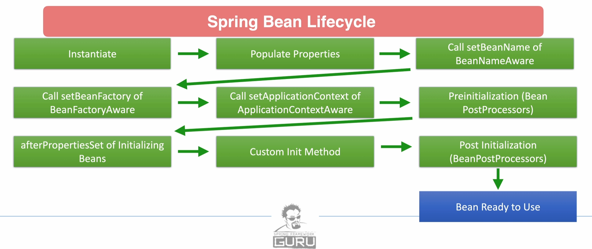
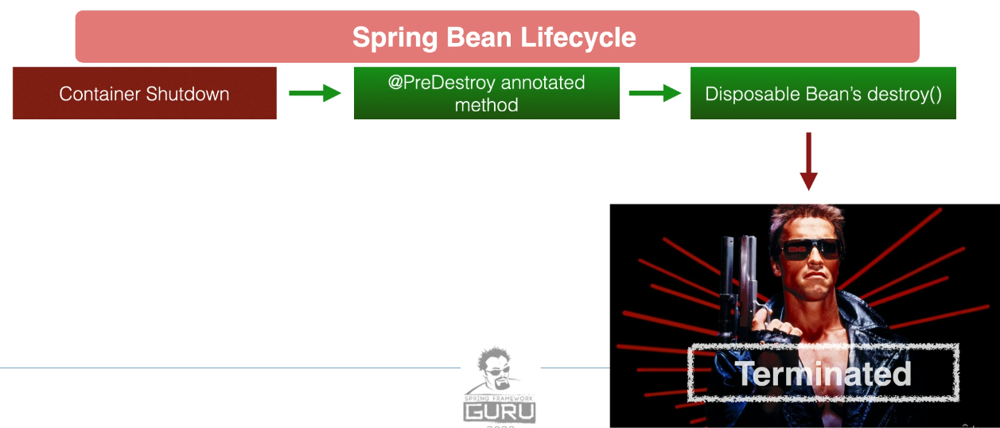
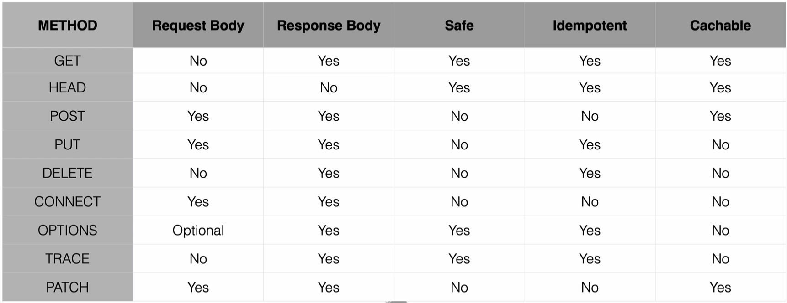

# Spring Framework 6: Beginner to Guru
## Spring 6 DI
This repository is for an example application built in my [Spring Framework 6 - Beginner to Guru](https://www.udemy.com/course/spring-framework-6-beginner-to-guru/?referralCode=2BD0B7B7B6B511D699A9) online course

The application is a simple Spring Boot 3 / Spring Framework 6 web application. It is used to help students learn how
to use the Spring Framework. Step by step instructions and detailed explanations can be found within the course.

As you work through the course, please feel free to fork this repository to your out GitHub repo. Most links contain links
to source code changes. If you encounter a problem you can compare your code to the lesson code. [See this link for help with compares](https://github.com/springframeworkguru/spring5webapp/wiki#getting-an-error-but-cannot-find-what-is-different-from-lesson-source-code)

## Spring Framework 6: Beginner to Guru Course Wiki
Got a question about your Spring Framework 6 course? [Checkout these FAQs!](https://github.com/springframeworkguru/spring5webapp/wiki)

## Getting Your Development Environment Setup
### Recommended Versions
| Recommended             | Reference                                                                                                                                                     | Notes                                                                                                                                                                                                                  |
|-------------------------|---------------------------------------------------------------------------------------------------------------------------------------------------------------|------------------------------------------------------------------------------------------------------------------------------------------------------------------------------------------------------------------------|
| Oracle Java 21 JDK      | [Download](https://www.oracle.com/java/technologies/downloads/#java21) | Java 17 or higher is required for Spring Framework 6. Java 21 is recommended for the course.                                                                                                                           |
| IntelliJ 2024 or Higher | [Download](https://www.jetbrains.com/idea/download/)                                                                                                          | Ultimate Edition recommended. Students can get a free 120 trial license [here](https://github.com/springframeworkguru/spring5webapp/wiki/Which-IDE-to-Use%3F#how-do-i-get-the-free-120-day-trial-to-intellij-ultimate) |
| Maven 3.9.6 or higher   | [Download](https://maven.apache.org/download.cgi)                                                                                                             | [Installation Instructions](https://maven.apache.org/install.html)                                                                                                                                                     |
| Gradle 8.7 or higher    | [Download](https://gradle.org/install/)                                                                                                                       |                                                                                                                                                                     |
| Git 2.39 or higher      | [Download](https://git-scm.com/downloads)                                                                                                                     |                                                                                                                                                                                                                        | 
| Git GUI Clients         | [Downloads](https://git-scm.com/downloads/guis)                                                                                                               | Not required. But can be helpful if new to Git. SourceTree is a good option for Mac and Windows users.                                                                                                                 |

## All Spring Framework Guru Courses
### Spring Framework 6
* [Spring Framework 6 - Beginner to Guru](https://www.udemy.com/course/spring-framework-6-beginner-to-guru/?referralCode=2BD0B7B7B6B511D699A9)
* [Spring AI: Beginner to Guru](https://www.udemy.com/course/spring-ai-beginner-to-guru/?referralCode=EF8DB31C723FFC8E2751)
* [Hibernate and Spring Data JPA: Beginner to Guru](https://www.udemy.com/course/hibernate-and-spring-data-jpa-beginner-to-guru/?referralCode=251C4C865302C7B1BB8F)
* [API First Engineering with Spring Boot](https://www.udemy.com/course/api-first-engineering-with-spring-boot/?referralCode=C6DAEE7338215A2CF276)
* [Introduction to Kafka with Spring Boot](https://www.udemy.com/course/introduction-to-kafka-with-spring-boot/?referralCode=15118530CA63AD1AF16D)
* [Spring Security: Beginner to Guru](https://www.udemy.com/course/spring-security-core-beginner-to-guru/?referralCode=306F288EB78688C0F3BC)

### Spring Framework 5
* [Spring Framework 5: Beginner to Guru](https://www.udemy.com/testing-spring-boot-beginner-to-guru/?couponCode=GITHUB_REPO) - Get the most modern and comprehensive course available for the Spring Framework! Join over 17,200 over Guru's in an Slack community exclusive to this course! More than 5,700 students have given this 53 hour course a 5 star review!
* [Spring Boot Microservices with Spring Cloud Beginner to Guru](https://www.udemy.com/course/spring-boot-microservices-with-spring-cloud-beginner-to-guru/?referralCode=6142D427AE53031FEF38) - Master Microservice Architectures Using Spring Boot 2 and Cloud Based Deployments with Spring Cloud and Docker
* [Reactive Programming with Spring Framework 5](https://www.udemy.com/reactive-programming-with-spring-framework-5/?couponCode=GITHUB_REPO_SF5B2G) - Keep your skills razor sharp and take a deep dive into Reactive Programming!
* [Testing Spring Boot: Beginner to Guru](https://www.udemy.com/testing-spring-boot-beginner-to-guru/?couponCode=GITHUB_REPO_SF5B2G) - ** Best Selling Course** Become an expert in testing Java and Spring Applications with JUnit 5, Mockito and much more!

### SQL
* [SQL Beginner to Guru: MySQL Edition](https://www.udemy.com/sql-beginner-to-guru-mysql-edition/?couponCode=GITHUB_REPO_SF5B2G) - SQL is a fundamental must have skill, which employers are looking for. Learn to master SQL on MySQL, the worlds most popular database!

### DevOps
* [Apache Maven: Beginner to Guru](https://www.udemy.com/apache-maven-beginner-to-guru/?couponCode=GITHUB_REPO_SF5B2G) - **Best Selling Course** Take the mystery out of Apache Maven. Learn how to use Maven to build your Java and Spring Boot projects!
* [OpenAPI: Beginner to Guru](https://www.udemy.com/course/openapi-beginner-to-guru/?referralCode=0E7F511C749013CA6AAD) - Master OpenAPI (formerly Swagger) to Create Specifications for Your APIs
* [OpenAPI: Specification With Redocly](https://www.udemy.com/course/openapi-specification-redocly-api-documentation/?referralCode=863C443928D61D9A3831)
* [Docker for Java Developers](https://www.udemy.com/docker-for-java-developers/?couponCode=GITHUB_REPO_SF5B2G) - Best Selling Course on Udemy! Learn how you can supercharge your development by leveraging Docker. Collaborate with other students in a Slack community exclusive to the course!
* [Spring Framework DevOps on AWS](https://www.udemy.com/spring-core-devops-on-aws/?couponCode=GITHUB_REPO_SF5B2G) - Learn how to build and deploy Spring applications on Amazon AWS!
* [Ready for Production with Spring Boot Actuator](https://www.udemy.com/ready-for-production-with-spring-boot-actuator/?couponCode=GITHUB_REPO_SF5B2G) - Learn how to leverage Spring Boot Actuator to monitor your applications running in production.

### Web Development with Spring Framework
* [Mastering Thymeleaf with Spring Boot](https://www.udemy.com/mastering-thymeleaf-with-spring/?couponCode=GITHUB_REPO_SF5B2G) - Once you learn Thymeleaf, you'll never want to go back to using JSPs for web development!

## Connect with Spring Framework Guru
* Spring Framework Guru [Blog](https://springframework.guru/)
* Subscribe to Spring Framework Guru on [YouTube](https://www.youtube.com/channel/UCrXb8NaMPQCQkT8yMP_hSkw)
* Like Spring Framework Guru on [Facebook](https://www.facebook.com/springframeworkguru/)
* Follow Spring Framework Guru on [Twitter](https://twitter.com/spring_guru)
* Connect with John Thompson on [LinkedIn](http://www.linkedin.com/in/springguru)

# Notes

## Basics of Dependency Injection

### Dependency Injection
DI is where a needed dependency is injected by another object/component/program.

Usually can be done via setter/constructor/property

The class that gets injected does not need to create instances of its dependencies.

Types of DI in Spring:
* Can use public or private properties
  * Using private properties is BAD PRACTICE, Spring uses reflection to set these properties which is slow and makes testing difficult
    * Personal note: testing part is arguable since mockito can inject mocks into private properties too, so testing won't become more difficult. Although it does impact performance of the unit tests.
* Setters are debated
* Constructors are most preferred

Classes vs Interfaces:
* DI can be done with concrete classes or with interfaces
* Generally avoid DI with concrete classes
  * allows runtime to decide implementation 
  * more SOLID (Interface segregation principle)
  * makes code more testable

### Inversion of Control (IoC)

This technique allows dependencies to be injected at runtime

IoC allows the framework to compose the application by controlling which implementation is injected
* example: H2 in memory db or MySQL db

Essentially, you only have to write the application itself and not the framework, because the control of the dependencies is in hands of the framework.

TL;DR:
* DI: You compose your classes with DI in mind, you might perform injections yourself.
* IoC: Control of dependency injection is handed (inverted) to the framework instead of the developer.

### Overall Best Practice

* Favor using Constructors
* Make private properties final and initialize them via constructor
* Whenever practical, use interfaces
* Do not use DI for EVERYTHING, be pragmatical.

## Spring Bean Lifecycle

Terminating a bean:

## Callbacks
There are 2 callback events you can use:
* InitializingBean.afterPropertiesSet()
  * Called after properties are set
* DisposableBean.destroy()
  * Called right before the bean is terminated

## Annotations
There are 2 annotations you can use to hook into the life cycle:
* PostConstruct
  * This runs when the bean is constructed but not returned yet to the requesting object
* PreDestroy
  * Called right before the bean is terminated

## Bean Post Processors

Enables to tap into Spring context life cycle

Called for all beans in context, hence you might want to type check

Implement BeanPostProcessor
* postProcessBeforeInitialization
* postProcessAfterInitialization

These are quite uncommon to use.

## Aware interfaces

Spring has over 14 "aware" interfaces, they are extensions of the Aware interface

These access can access the Spring Framework infrastucture

Within the framework it is quite common to use

Rarely used by Spring developers themselves

If you ever need them they could come in handy

## HTTP

### Safe Methods

Cause no changes on the server, only fetches information
* GET
* HEAD
* OPTIONS
* TRACE

### Idempotent Methods

Idempotence - Quality of an action such that repetitions of the action have no further effect on the outcome
* PUT
* DELETE
* All the safe methods (GET, HEAD, TRACE, OPTIONS) are also idempotent

### Non-Idempotent Methods
POST creates a resource whenever is called

### HTTP Request Overview

## REST

Representational State Transfer (REST)
* Representation: typically JSON or XML
* State Transfer: typically via HTTP
* Established by Roy Fielding from 2000 doctoral dissertation

REST APIs use HTTP verbs to create, manage and delete server resources

Resources are usually data structures represented by JSON or XML

HTTP status codes communicate success, failure, errors

REST is **not** a formal standard, more like generally agreed upon methods and techniques 
(SOAP on the other hand **is** a standard with formal structure and a committee behind it)

In the 2020s the industry does agree on how REST should be and should not be implemented. But there can be numerous cases where you need to differ from these opinions.

### RESTful Terminology

* Verbs - HTTP methods
* Messages - payload of the action (JSON/XML)
* URI - Uniform Resource Identifier
  * Unique string identifying any resource (not necessary related to the internet)
* URL - Uniform Resource Locator
  * An URI with network information
  * http://www.example.com/cars/1
* Idempotence - You can exercise an operation multiple times without changing the result
* Stateless - Service does not maintain any client state
* HATEOAS - Hypermedia As The Engine of Application State
  * REST client should be able to use hyperlinks provided by the server to discover all the available actions and resources it needs
  * for client requests the server responds with hyperlinks to other available actions
  * this concept is uncommon in the industry, advanced REST APIs do often use this concept

### Richardson Maturity Model (RMM)

**Level 0 - Swamp of POX**
* POX: Plain Old XML
* One URI
* One verb
* Ex.: RPC, SOAP, XML-RPC

**Level 1 - Resources**
* Multiple URIs which identify multiple resources
* One verb

**Level 2 - HTTP Verbs**
* Multiple verbs with URIs for desired actions
* Most common use of REST APIs

**Level 3 - Hypermedia**
* Response contains URIs that helps consumers explore the API
* No clear standard for this level though
* Spring provides its own implementation for HATEOS
* Quite rare for now

## REST in Spring

Spring Framework has 2 web client (for consuming) and 3 web frameworks (for creating) RESTful services

Spring Framework also has multiple libraries for RESTful services

### Spring MVC (web framework) is the most commonly used library for creating RESTful services
* Compatible with Java EE (Jakarta EE in Spring 6)
* Based on traditional Java Servlet API
  * However, this makes Spring MVC ***blocking*** and ***non-reactive***

### Spring WebFlux (web framework)
* Introduced with Spring Framework 5
* Uses project Reactor
  * Provides ***reactive*** web services
  * Does not use Java Servlet API, so it's ***non-blocking***
* Follows closely to the configuration model of Spring MVC
  * Easy transition from Spring MVC

### Spring WebFlux.fn (web framework)
* Introduced with Spring Framework 5
* Functional programming model for defining endpoints
* Alternative to annotation based configuration
* Rapid and simple definition of microservice endpoints

### Spring RestTemplate (web client)
* Primary library for consuming RESTful web services
* Very mature
* Highly configurable
* From Spring Framework 5 it's been in maintenance mode
  * No more new features
  * Going to get deprecated
  * Spring recommends ***WebClient*** for new development

### WebClient (web client)
* Introduced with Spring Framework 5
* ***Reactive*** web client
* By default, uses Reactor Netty, non-blocking HTTP client library

### Marshalling/unmarshalling

Marshalling: Process of converting POJOs to JSON or XML

Unmarshalling: JSON or XML -> POJO

By default, Spring Boot configures Jackson for marshalling and unmarshalling

Spring Boot supports other libraries that can be used

## Project Lombok

Helps to reduce boilerplate code in Java.

How it works:
* Hooks in via the annotation processor API
* AST (raw source code) is passed to Lombok for code generation before java continues
* Produces properly compiled Java code in conjunction with the Java compiler
* Code is generated and compiled: no run-time performance penalty
* If you write an implementation of a Project Lombok method, then your code will be used
  * Easy to override Lombok generated code

Older IDEs can get confused by the injected code, since the source files do not contain the methods that the compiled code has.

Plugins may be necessary for certain IDEs to support Lombok.

### Lombok features

* val - declares final local variable
* var - declares mutable local variable
* @Getter
* @Setter
  * Creates setters for all **non-final** properties
* @ToString
  * String of classname + each field seperated by commas + optional parameters
* @EqualsAndHashCode
  * By default, uses non-static, non-transient properties
  * Can also exclude specific properties
* @NoArgsConstructor
  * Error if there are any final fields
* @RequiredArgsConstructor
  * Generates constructor for all fields that are final or marked @NonNull
* @Data
  * Generates typical POJO boilerplate
  * Combines @Getter @Setter @ToString @EqualsAndHashCode @RequiredArgsConstructor
  * No constructor is generated if you already explicitly declared one
* @Value
  * Immutable variant of @Data
  * All fields are made private and final by default
* @NonNull
  * Set on parameter of method or constructor
  * NPE thrown if parameter is null
* @Builder
  * Creates a "builder" pattern
* @SneakyThrows
  * Throw checked exceptions without declaring in calling method's throws clause
* @Synchronized
  * Safer implementation of Java's synchronized
* @Log
  * Creates a Java util logger
  * Java util loggers considered awful
* @Slf4j
  * Creates SLF4J logger
  * Recommended since SLF4J is a generic logging facade
  * Spring Boot's default logger is LogBack